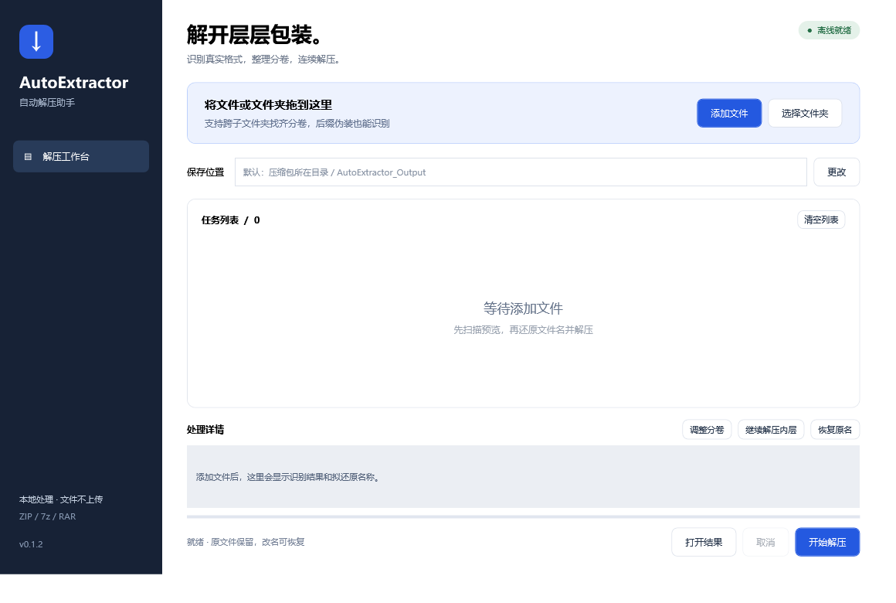

# AutoExtractor · 自动解压助手

Windows 中文桌面工具，自动识别被改后缀的 ZIP / 7z / RAR，整理分卷，输入密码后连续解开多层包装。

所有文件在本地处理，无需联网、账号或额外安装解压工具。



## 下载与使用

1. 在 [Releases](https://github.com/peterL1244/AutoExtractor/releases) 下载 `AutoExtractor-v0.1.2-win-x64.zip`。
2. 解压整个便携包，保留 `tools` 文件夹及其他随附文件，双击 `AutoExtractor.exe`。
3. 拖入下载文件或文件夹。分卷分散在 `1`、`2` 等子文件夹时，拖入共同父文件夹，或同时／先后添加这些文件夹，程序会在导入范围内找齐关联分卷。
4. 查看识别结果和“原名称 → 还原名称”，取消勾选想跳过的任务，点击“开始解压”。加密包会弹出密码框。
5. 完成后点击“打开结果”，直接进入唯一明确的内容目录，跳过外面只有一个子目录的包装层；多个结果或仍有失败任务时保留完整结果入口。智能停止或待确认的内层文件可用“继续解压内层”添加到任务列表。

支持 Windows 10/11 x64；便携包包含 .NET 运行环境与完整 7-Zip 引擎。源码开发才需要 .NET SDK。

## 能处理什么

| 下载文件情况 | 处理方式 |
| --- | --- |
| ZIP/7z/RAR 被改为 JPG、MP4、TMP、EXE | 读取内容识别格式，验证后还原后缀 |
| `.001/.002` 或 `名称01.jpg/名称02.mp4` | 根据名称、编号及文件结构分组，按字节切分格式验证 |
| RAR 的 `.part01.rar`、`.rar/.r00` | 按对应分卷体系还原 |
| `1/名称.part1.exe` 与 `2/名称.part2.rar` | 识别为同一组 RAR 自解压分卷，验证后集中到入口卷文件夹 |
| ZIP 的 `.z01/.z02/.zip` | 以末尾 ZIP 主文件为入口读取 |
| 压缩包里还有压缩包 | 只扫描新解出的内容，连续处理最多 10 层 |
| 普通可执行程序、自解压程序 | 普通程序不解包；自解压程序仅作为归档读取，绝不运行 |
| `download3397.exe` 等带数字下载编号的完整自解压包 | 不把下载编号直接当成卷号，继续解开确认存在的压缩载荷 |

自动识别不等于猜测任意文件的顺序。文件名被完全打乱、分卷缺失或证据冲突时，会显示“待确认”或“缺少分卷”。通过“调整分卷”选择成员、调整顺序、指定真实格式及分卷体系；点击确认后仍要通过引擎验证才会改名。不要把多个独立压缩包组成一组。

跨文件夹查找仅覆盖已导入的目录和文件，不会向上扫描整个下载盘。只拖入 `1` 时，请继续添加 `2`，或直接拖入它们的共同父文件夹。不同目录存在同名同序号分卷时保留待确认；独立的完整压缩包不会仅因同名而被合并。

## 文件名与结果目录

- **整理与改名**：成功验证归档后恢复正确后缀。跨文件夹分卷集中到入口卷所在目录（通常是首卷；ZIP 原生分卷以末尾 `.zip` 为入口），原始内容不改变。详情面板显示源路径和整理目标。
- 改名记录保存在所有源目录的共同父目录下的 `.autoextractor-journals` 中；同目录任务仍保存在原目录。点击“恢复原名”，选择对应 JSON 记录，同时恢复文件名和原文件夹位置；内容变化或名称被占用时会拒绝恢复，避免覆盖。原文件夹应保留。
- 不删除原压缩包和中间层包。不要在任务运行时手动移动、编辑或删除这些文件。
- 默认结果放在输入目录旁的 `AutoExtractor_Output`，每个任务、每一层使用独立子目录。
- 失败解压保留在名称含 `incomplete` 的目录中；这不代表完成。取消后可以重试，确认不再需要时自行删除未完成目录。
- 验证阶段在同目录使用临时硬链接；文件系统不支持时才复制临时副本，并检查空间。完整性验证和改名哈希检查会读取大文件，因此大包开始阶段可能耗时。

## 密码与智能停止

密码只在当前任务内存中复用，不保存到配置或日志。不同层密码不同时会再次询问；“跳过此任务”保留文件并处理其他任务。引擎运行期间，具备本机进程查看权限的软件可能看到传给引擎的密码参数。

出现普通 EXE 及配套文件时，软件停止该目录的自动递归，避免继续拆软件资源。默认跳过 JAR、APK、Office 文档和常见资源容器。仍需继续时，选中任务使用“继续解压内层”。

完成后的目录按软件自身结构保留：有的软件使用 `game/lib/renpy`，有的软件使用 EXE 与 PCK 等配套文件。不会人为创建另一种引擎的目录，也不会自动运行解出的程序。

## 边界与故障

- 不恢复缺失或已损坏的分卷，不破解密码，不安装或运行解出的软件。
- 跨文件夹自动整理要求位于同一磁盘／共享且拥有独立共同父目录；跨磁盘或共同父目录为磁盘根目录时，会提示先复制到同一独立目录。
- 某些加密损坏与密码错误无法仅凭引擎错误区分，会同时提示两种可能。
- 为防止越界和覆盖，拒绝绝对路径、上级目录跳转、链接、Windows 保留文件名、大小写冲突及无法安全解析的归档元数据。包含此类条目的归档需要其他可信流程处理。
- 单次归档条目上限 200,000，引擎文本输出上限 32 Mi 字符，自解压载荷探测限于文件前 4 MiB；超出范围提示手动处理。
- 文件扫描依靠内容与结构，不能保证覆盖所有人为混淆、超大自解压外壳、特殊 RAR 模式或罕见分卷工具。
- 已验证真实 RAR5 八分卷，以及 RAR4/RAR5 单包的数据加密、文件名加密；加密 RAR 分卷组合仍需更多实际样本。ZIP64 用小型结构夹具验证，尚未用超过 4 GiB 的完整归档做端到端解压。
- ZIP 原始文件名会额外核对；7z/RAR 的某些控制字符可能被引擎规范化为下划线，最终仍须通过安全路径与输出核验。
- 便携版尚未做代码签名。项目不包含下载站提供的游戏、软件、密码或汉化资源。

## 开发与测试

安装 `global.json` 指定的 .NET 10 SDK 和 PowerShell 7，在项目目录执行：

```powershell
dotnet build AutoExtractor.sln -c Release
dotnet run --project tests/AutoExtractor.Tests -c Release
dotnet run --project tests/AutoExtractor.App.SmokeTests -c Release
./scripts/build.ps1
```

测试使用可重复生成的 ZIP/7z 小文件及有来源与许可的 RAR 夹具，真实调用随附引擎；测试失败会返回非零退出码。测试覆盖格式识别、分卷组合、改名恢复、加密交互、多层处理及文件保护。测试夹具来源见 `tests/fixtures/libarchive`。

便携版输出到 `artifacts/AutoExtractor-v0.1.2-win-x64`，发布 ZIP 与 SHA-256 清单输出到 `artifacts`。包名由 `Directory.Build.props` 版本生成，更新包保留旧版文件夹。GitHub Actions 在 main 推送和 PR 时测试并打包，版本标签触发 Release 发布。

## 代码结构与许可

- `AutoExtractor.Core`：文件内容识别、分卷分组、改名记录与恢复。
- `AutoExtractor.Engine`：7-Zip 适配、归档预检、解压与多层协调。
- `AutoExtractor.App`：WPF 中文界面。
- `AutoExtractor.Tests`：独立可运行的自动测试。

原创代码采用 [MIT](LICENSE)；随附引擎、运行环境及测试材料保留各自许可，详见 [第三方说明](THIRD_PARTY_NOTICES.md)。
